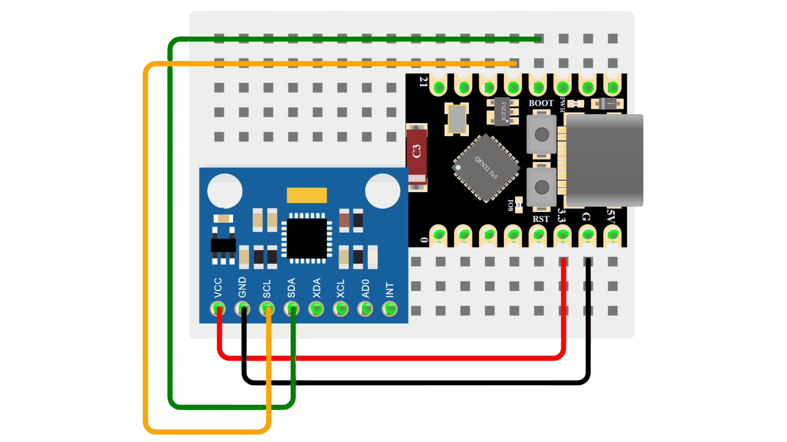

<!-- ─── Banner ─────────────────────────────────────────────────────────── -->
<p align="center">
  <!-- Replace the line below with your header image or GIF -->
  <!--  -->
</p>

<h1 align="center">⚡ ESP32 Mocap Visualizer</h1>

<p align="center">
  Real-time motion capture using an <b>ESP32-C3 SuperMini</b> and <b>MPU6050</b> IMU sensor,
  visualized in a browser-based 3D character viewer.
</p>

---

## ✨ Features

| Feature | Description |
|---------|-------------|
| 🎯 **Real-time streaming** | 60 Hz IMU data over USB Serial via Web Serial API |
| 🧍 **3D character animation** | Arm & leg bone rotation driven by sensor data |
| 🎮 **Record & playback** | Record arm/leg movements and play them back individually or together |
| 🎚️ **Movement scale** | Adjustable sensitivity sliders for arms, legs, and playback speed |
| 🗺️ **3D axis overlay** | Corner overlay showing world-space orientation |
| 🌗 **Light & dark mode** | Full theme support with one-click toggle |
| 🖥️ **Cross-browser** | Works in Chrome, Edge, and Opera (Web Serial required) |
| 📱 **Responsive layout** | Adapts to different screen sizes |

---

## 🧰 Hardware Required

| Component | Qty | Notes |
|-----------|-----|-------|
| ESP32-C3 SuperMini | 1 | Any ESP32-C3 board works |
| GY-521 MPU6050 | 1 | 6-axis IMU breakout |
| Jumper wires | 4 | For I2C connection |

---

## 🔌 Wiring

<p align="center">
  
</p>

### Pin Mapping

| GY-521 Pin | ESP32-C3 Pin | Description |
|------------|--------------|-------------|
| **VCC** | 3.3V | Power supply |
| **GND** | GND | Ground |
| **SDA** | GPIO 8 | I2C data |
| **SCL** | GPIO 9 | I2C clock |

> ⚠️ **Important:** Some GY-521 modules have an on-board 3.3V regulator and accept 5V input, but the ESP32-C3 is a 3.3V device. Always use **3.3V** to be safe.

---

## 🚀 Setup Guide

### 1 — Flash the ESP32 Firmware

1. Install the [Arduino IDE](https://www.arduino.cc/en/software) or [PlatformIO](https://platformio.org/)
2. Install the **ESP32-C3 board support**:
   - Arduino IDE: *File → Preferences → Additional Board Manager URLs* → add:
     ```
     https://espressif.github.io/arduino-esp32/package_esp32_index.json
     ```
   - Then: *Tools → Board → Board Manager → search "esp32" → install*
3. Open `esp32-motion-capture/esp32-motion-capture.ino`
4. Select board: *Tools → Board → ESP32 Arduino → **ESP32-C3 Dev Module***
5. Select port and **Upload**

### 2 — Install & Run the Web UI

```bash
# Clone the repository
git clone https://github.com/your-username/esp32-mocap.git
cd esp32-mocap

# Install dependencies
npm install

# Start development server
npm run dev
```

The app opens at **http://localhost:5173**

### 3 — Connect & Visualize

1. Open the app in **Chrome / Edge / Opera**
2. Click **Web Serial** in the sidebar
3. Select your ESP32-C3 port (usually `USB JTAG/serial debug unit`)
4. The 3D character should start moving with your sensor!

---

## 📂 Project Structure

```
esp32-mocap/
├── esp32-motion-capture/        # Arduino firmware for ESP32-C3
│   └── esp32-motion-capture.ino
├── public/
│   ├── models/                  # 3D character models (.glb)
│   └── logos.png                # Background logo
├── src/
│   ├── components/
│   │   ├── MocapViewer.jsx      # Three.js 3D scene & character renderer
│   │   ├── SensorPanel.jsx      # Sidebar UI (controls & readouts)
│   │   └── AxisIndicator.jsx    # Camera orientation overlay
│   ├── context/
│   │   └── ThemeContext.jsx     # Light/dark theme provider
│   ├── hooks/
│   │   └── useSensorData.js     # Web Serial + sensor parsing hook
│   ├── lib/
│   │   └── rigController.js     # Skeleton bone rotation engine
│   ├── App.jsx                  # Root layout & state management
│   ├── main.jsx                 # Entry point
│   └── index.css                # Global styles
├── package.json
├── vite.config.js
└── vercel.json                  # Deployment config
```

---

## 🛠️ Tech Stack

| Layer | Technology |
|-------|-----------|
| **Microcontroller** | ESP32-C3 SuperMini |
| **Sensor** | MPU6050 (I2C, 400 kHz) |
| **Firmware** | Arduino C++ |
| **Frontend** | React 19 + Vite 8 |
| **3D Engine** | Three.js r184 |
| **Styling** | Tailwind CSS 4 |
| **Communication** | Web Serial API (USB CDC) |

---

## 📊 Data Flow

```
┌──────────────┐      I2C       ┌──────────────┐     USB Serial     ┌──────────────┐
│  MPU6050     │ ──────────────►│  ESP32-C3    │ ──────────────────►│  Browser     │
│  (GY-521)    │   60 Hz accel  │  SuperMini   │   JSON @ 115200    │  Web UI      │
│              │   & gyro data  │              │   baud             │              │
└──────────────┘                └──────────────┘                    └──────┬───────┘
                                                                          │
                                                                  ┌───────▼───────┐
                                                                  │  Three.js     │
                                                                  │  3D Character │
                                                                  │  Animation    │
                                                                  └───────────────┘
```

---

## 🔧 Troubleshooting

| Problem | Solution |
|---------|----------|
| **"No I2C devices found"** | Check SDA→GPIO8 and SCL→GPIO9 wiring. Ensure MPU6050 is powered. |
| **"MPU6050 not responding"** | Verify the I2C address is `0x68`. Try pulling AD0 pin to GND. |
| **Web Serial not available** | Use Chrome, Edge, or Opera on desktop. Not supported on mobile. |
| **Character doesn't move** | Open browser DevTools console to check for errors. Verify serial connection. |
| **Jittery movement** | The firmware applies a low-pass filter. Increase `KALMAN_GAIN` for faster response. |

---

## 📜 License

MIT

---

<p align="center">
  Made with ❤️ for the maker community
</p>
